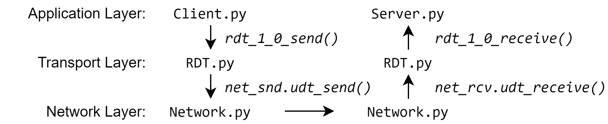

# CSCI 466 PA2 - Reliable Data Transmission (RDT)

## Instructions

Complete the following assignment by yourself, or in a group of two.
Submit your work on D2L into the "Programming Assignment 2" folder. 
Please have only one member of the group submit.


## Learning Objectives

In this programming assignment you will:

- Work with a layered network architecture
- Understand and implement the Stop-and-Wait Protocol with ACKs (Acknowledgments), NACKs (Negative
Acknowledgments), and re-transmissions


## Assignment

During this project, you will implement the Reliable Data Transmission protocols RDT 2.1, and RDT 3.0 discussed in class and the textbook, by extending an RDT 1.0 implementation.


### Starting Code

The starting code for this project provides you with the implementation of several network layers that cooperate to achieve end-to-end communication.

<p align="center">

</p>

The client sends messages to the server, which converts them to [pig latin](https://en.wikipedia.org/wiki/Pig_Latin) and transmits them back.
The client and the server send messages to each other through the transport layer provided by an RDT implementation using the `rdt_1_0_send` and `rdt_1_0_receive` functions.
The starting `rdt.py` provides only the RDT 1.0 version of the protocol, which does not tolerate packet corruption, or loss.
The RDT protocol uses `udt_send` and `udt_receive` provided by `network.py` to transfer bytes between the client and server machines.
The network layer may corrupt packets or lose packets altogether.
`rdt.py` relies on the `Packet` class (in the same file) to form transport layer packets.

Your job will be to extend `rdt.py` to tolerate packet corruption and loss.
The provided code  lists prototype send and receive functions for these protocols.
You may need to modify/extend the `Packet` class to transmit the necessary information for these functions to work correctly.
The provided implementation of `network.py` is reliable, but we will test your code with non-zero probability for packet corruption and loss by changing the values of `prob_pkt_loss` and `prob_byte_corr` of the `NetworkLayer` class.
You should change those variables yourself to test your code and show that your protocol implementations tolerate corruption and loss in your demonstration videos.

### Program Invocation

To run the starting code you may run:

```
python server.py 5000
```

and

```
python client.py localhost 5000
```

in separate terminal windows. 
Be sure to start the server first, to allow it to start listening on a socket used by `network.py`, and start the client soon after, before the server times out.


## BONUS 

We will award __one bonus point__ for each of the following:

* The network layer may also reorder packets.
If you set `prob_pkt_reorder` to a non-zero probability you will start seeing packet that are reordered.
Implement RDT 3.1, which delivers packets in the correct order.

* RDT 3.1 is a stop and wait protocol.
Implements RDT 4.0 - a pipelined reliable data transmission protocol based on either Go-back-N (GBN), or Selective Repeat (SR) mechanisms.


## What to Submit

You will submit different versions of `rdt.py`, which implements the send and receive functions for RDT&nbsp;2.1, and RDT&nbsp;3.0.
RDT&nbsp;2.1 tolerates corrupted packets through retransmission.
RDT&nbsp;3.0 tolerates corrupted and lost packets through retransmission.
The necessary functions prototypes are already included in `rdt.py`.
For the purposes of testing you may modify `client.py` and `server.py` to use these functions instead of those of RDT&nbsp;1.0.
You will also submit a link to a YouTube video showing an execution of your code for each version of the protocol.
Please make sure to include the link to your YouTube videos not in a text file, but through the D2L submission form.
Also, please make sure that your YouTube videos are voiced over and point out that your code does the different things that the grading rubric asks for. 
Videos longer than 5 minutes will not be graded.

## Grading Rubric

We will grade the assignment as follows:

* \[1 point\] Submit a `partner.txt` file.
If you're working with a partner, `partner.txt` should include the name of your partner.
If you're working by yourself, `partner.txt` should include the word "solo".

* \[1 point\] Submit a `contributors.txt` created by running the following command inside your git repository:

        git log --pretty=format:"%h %an %ad - %s" --shortstat --date=short > contributors.txt

    I will consult this file and adjust partner grades in case there are discrepancies in effort.

* \[10 points\] `rdt_2_1.py`, `client_2_1.py`, `server_2_1.py`, `network_2_1.py` that correctly implement RDT&nbsp;2.1 and a link to a YouTube video showing the execution of your program.
Make sure your videos are under 5 minutes long - __we will only watch the first five minutes of your video__.

  * \[2 points\] RDT&nbsp;2.1 delivers data under no corruption in the network

  * \[2 points\] RDT&nbsp;2.1 uses a modified Packet class to send ACKs

  * \[2 points\] RDT&nbsp;2.1 does not deliver corrupt packets

  * \[2 points\] RDT&nbsp;2.1 uses modified Packet class to send NAKs for corrupt packets

  * \[2 points\] RDT&nbsp;2.1 resends data following a NAK

* \[13 points\] `rdt_3_0.py`, `client_3_0.py`, `server_3_0.py`, `network_3_0.py` that correctly implement RDT&nbsp;3.0 and a link to a YouTube video showing the execution of your program.
Make sure your videos are under 5 minutes long - __we will only watch the first five minutes of your video__.

  * \[2 points\] RDT&nbsp;3.0 delivers data under no corruption or loss in the network and uses a modified Packet class to send ACKs
  
  * \[2 points\] RDT&nbsp;3.0 does not deliver corrupt packets and uses modified Packet class to send NAKs
  
  * \[2 points\] RDT&nbsp;3.0 resends data following a NAK
  
  * \[2 points\] RDT&nbsp;3.0 retransmits a lost packet after a timeout
  
  * \[2 points\] RDT&nbsp;3.0 retransmits a packet after a lost ACK
  
  * \[3 points\] RDT&nbsp;3.0 ignores a duplicate packet after a premature timeout (or after a lost ACK)

* \[1 points\] (BONUS) `rdt_3_1.py`, `client_3_1.py`, `server_3_1.py`, `network_3_1.py` that correctly implement RDT&nbsp;3.1 and a link to a YouTube video showing the execution of your program.

* \[1 points\] (BONUS) `rdt_4_0.py`, `client_4_0.py`, `server_4_0.py`, `network_4_0.py` that correctly implement RDT&nbsp;4.0 and a link to a YouTube video showing the execution of your program.


## Acknowledgements

This project was adapted from [Kishore Ramachandran version of this assignment](https://www.cc.gatech.edu/~rama/CS2200-External/projects/p5/prj5.html).


