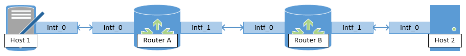
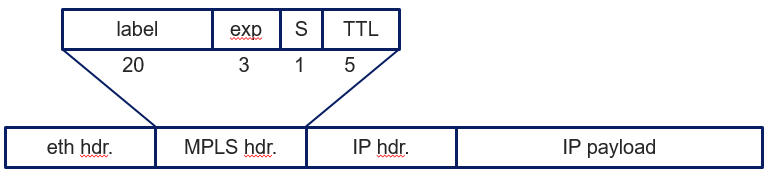
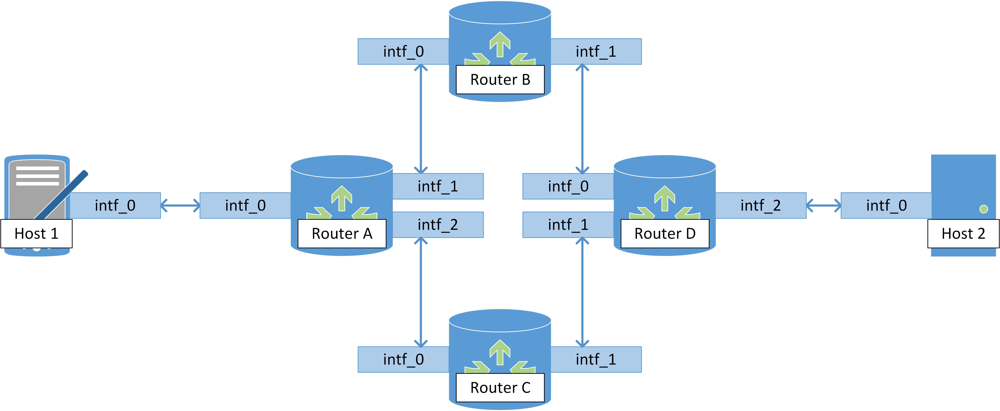

# CSCI 466 Programming Assignment - MPLS 

## Instructions


Complete the following assignment in pairs, or groups of three. 
Submit your work on D2L into the “Programming Assignment 5” folder. 
All partners will submit the same solution and we will only grade one solution for each group.


## Learning Objectives

In this programming assignment you will:

- Implement MPLS forwarding on routers
- Control forwarding paths using MPLS labels
- Implement priority-based forwarding on routers


## Overview

In this project, you will implement MPLS forwarding and priority-based forwarding at routers.
You will also have a greater autonomy over and responsibility for the design of your protocol based on the requirements. 

### Starting Code 

The code provides you with the implementation several network layers that cooperate to provide end-to-end communication. 

```
NETWORK LAYER (network.py) 
DATA LINK LAYER (link.py) 
```

The code also includes `simulation.py` that manages the threads running the different network objects. Currently, `simulation.py` defines the following network.


<!--  -->

At a high level the network includes hosts, routers and links. 
`Hosts` generate and receive traffic. 
`Routers` forward packets between interfaces.
`Links` connect network interfaces of routers and hosts. 
Finally, the `LinkLayer` implements a thread that forwards traffic along links.
In this assignment forwarding speed is restricted by link capacity. 
Please consult the [video lecture](https://www.youtube.com/watch?v=nNLOUlj6MMc) for a more in-depth explanation of the code.

### Program Invocation

To run the starting code you may execute:

```
python simulation.py
```

The current `simulation_time` in `simulation.py` is __10 seconds__ to account for the delay of packet forwarding. 
As the network becomes more complex and takes longer to execute, you may need to extend the simulation to allow all the packets to be transfered.


## Assignment

1. [10 points] Implement MPLS forwarding such that only links incident on hosts carry `NetworkPackets` and links between routers only carry `MPLSFrames`.

	a. [4 points] Implement the `MPLSFrame` class to encapsulate `NetworkPackets` as MPLS frames.
	In the lectures slides we presented the MPLS frame structure and position with respect to link (Ethernet) and network (IP) layer packets as:

	

	In this project we simplify Ethernet frame as `LinkFrame` in `link.py` and IP as `NetworkPacket` in `network.py`.
	`LinkFrame` carries both `MPLSFrames` and `NetworkPackets` and its `type_S` field allows the network process at the `Router` to differentiate between the two and handle them appropriately.

	Your task is to implement `MPLSFrame` to encapsulate `NetworkPackets`.
	Encapsulation should take place on the first hop router according the the rules defined in `encap_tbl_D` parameter to the `Router`. 
	The structure of that table is up to you to define. 
	Similarly, you do not need to implement all the fields of an MPLS frame.
	The MPLS frame should contain the label at the least. 
	You may add experimental bits, S bit, and time to live if you choose.
	You will need to modify `Router.process_network_packet()` to implement MPLS encapsulation.

	b. [4 points] Implement MPLS forwarding based on MPLS forwarding tables passed to the `Router` constructor as `frwd_tbl_D`.
	The structure of `frwd_tbl_D` is up to you, but the tables should contain the in label, in interface, out label, and out interface.
	For each router, pass in correctly designed forwarding tables so that your routers achieve end-to-end connectivity.
	You will need to modify `Router.process_queues()` and `Router.process_MPLS_frame()` to implement MPLS forwarding.

	c. [2 points] Implement MPLS decapsulation at last hop router to deliver `NetworkPacket` to end hosts.
	Decapsulation should take place according to the rules defined in `decap_tbl_D` parameter to the `Router`.
	The structure of that table is up to you to define. 
	You will need to modify `Router.process_MPLS_frame()` to implement MPLS decapsulation and forwarding.


	Submit your code as `link_1.py`, `network_1.py`, and `simulation_1.py`.
	Submit a YouTube video link showing the execution of `simulation_1.py`.
	We will grade you based on correct forwarding actions and content of your MPLS frames.
	Make sure that all of these are clearly visible in your output and the video.
	


2. [5 points] Implement MPLS forwarding, such that packets from different hosts follow different paths.
Configure the more complex network shown below in `simulation.py`.
Add transmissions from `Host 1` and `Host 2` to `Host 3` and configure MPLS tables such that routers encapsulate `NetworkPackets` as `MPLSFrames` and forward the packets from the different hosts on different paths.


	<!--  -->
	  

	Submit your code as `link_2.py`, `network_2.py`, and `simulation_2.py`.
	Submit a YouTube video link showing the execution of `simulation_2.py`.
	We will grade you based on correct forwarding actions.
	Make sure these are clearly visible in your output and the video.

3. [10 points] Implement strict priority forwarding on the MPLS routers. 

	a. [2 points] Recall that the IP header has a type of service (TOS) field that carries packet priority.
	`NetworkPacket` constructor in this assignment has a `priority` argument, though it is currently unused.
	The `udt_send()` function in simulation.py sends packet with priorities 0 and 1. 
	Assume higher number priorities are higher priorities, i.e. 1 is higher than 0. 
	Extend `NetworkPacket` to carry the priority number with which it was sent.

	b. [3 points] Recall that forwarding at this assignment (at the link layer) accounts for link capacities.
	You will notice a bottleneck at `Router B` in problem 1, where queued packets take a while to offload.
	Implement a similar bottleneck at `Router D` in the network from problem 2.
	Change the program output to show how many packets of each priority remain queued at each router.
	You may inspect the priority in the encapsulated `NetworkPackets` to do so, or devise another method.

	c. [5 points] Implement strict priority forwarding at each router.
	While in 2.b you may 'cheat' by looking at `NetworkPacket` priority, MPLS forwarding should be done while looking only at the MPLS header.
	However, the MPLS header does not carry a priority field and you should not extend it to do so.
	Devise and implement another method, such that the MPLS routers encapsulate `NetworkPackets` at the edge and forward them (on different paths as in problem 2) with strict priority.

	Submit your code as `link_3.py`, `network_3.py`, and `simulation_3.py`.
	Submit a YouTube video link showing the execution of `simulation_3.py`.
	We will grade you based on correct implementation of strict priority forwarding in MPLS.
	Make sure these to explain your approach to 3.c and clearly show that you achieve strict priority forwarding in your output and the video.


4. [1 point] BONUS: Implement Weighted fair queuing (WFQ) instead of strict priority in question 3.

	Submit `link_4.py`, `network_4.py`, and `simulation_4.py`.


5. [1 point] BONUS: Implement a central controller to automatically configure MPLS forwarding tables in question 2 based on a global knowledge of network topology. 

	Submit `link_5.py`, `network_5.py`, and `simulation_5.py`.


